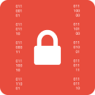

# Strapi's Encryptable Field Plugin

> This field type encrypts the value on create and update.  
> And decrypts on fetch one and many.

> DO NOT USE ENCRYPTION TO STORE USER PASSWORDS, FOR THIS YOU USE HASHING.  
> ONLY STORE PII DATA WHEN NEEDED AND ONLY THE BARE MINIMUM.   
> CONSULT THE RULES AROUND PII DATA THAT APPLY IN THE REGIONS YOU OPERATE IN.


[](https://market.strapi.io/plugins/strapi-plugin-encryptable-field)

**DISCLAIMER**
> Before using this in production make sure you have tested that this plugin is able to encrypt and decrypt all your
> expected data.
> Failure to decrypt results in loss of data.

## Encryption method

| Method      | IV Length | Encryption key                                                         |
|-------------|-----------|------------------------------------------------------------------------|
| aes-256-cbc | 16        | 32 bytes hex string, provided by environment variable `ENCRYPTION_KEY` |

## ✨ Supported Strapi Versions

The Encryptable Field plugin is only compatible with Strapi v4.

## ⚙️ Installation

```bash
# If you use NPM
npm install strapi-plugin-encryptable-field

# If you use Yarn
yarn add strapi-plugin-encryptable-field
```

### Configuring the plugin

Open or create the file `config/plugins.js` and enable the plugin by adding the following snippet:

```js
module.exports = {
    // ...
    'encryptable-field': {
        enabled: true,
    },
};
```

Add the environment variable `ENCRYPTION_KEY` to your server and the .env.

### Using the plugin

After installation and configuration the custom field is ready to use.  
When adding a new field, go to **custom** and select **Encryptable**.


#### Basic Settings

> Because you loose some options to validate a field (for example an email field), you can make use of a regex and a
> hint to
> tell the user what you expect.


#### Advanced Settings

> By default, all fields will be decrypted when queried. It is also possible to only show the decrypted values for one
> or
> more roles.


> Below images show what it looks like in a form and overview when decryption is enabled for a specific role.


## 🚀 Roadmap

- [x] Role based decryption